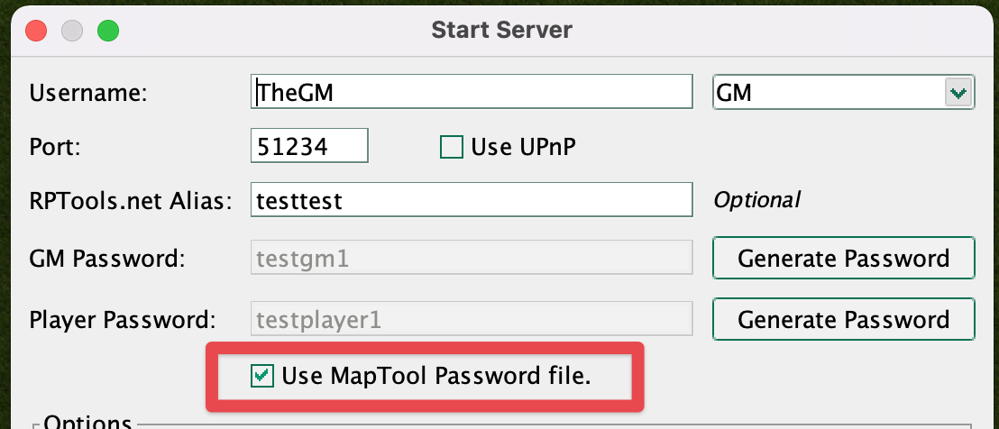
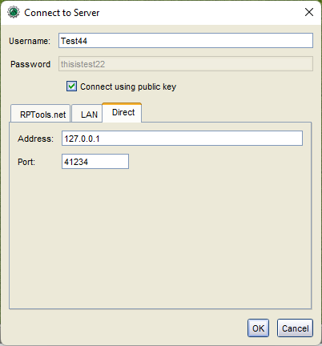
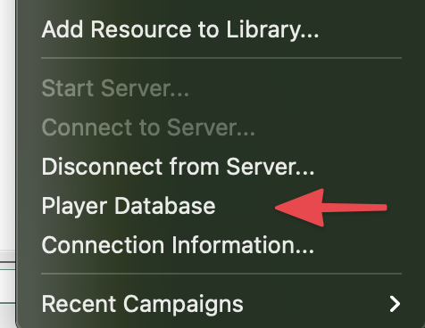
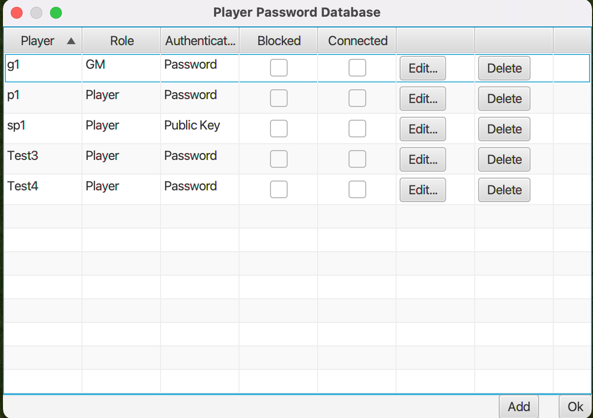
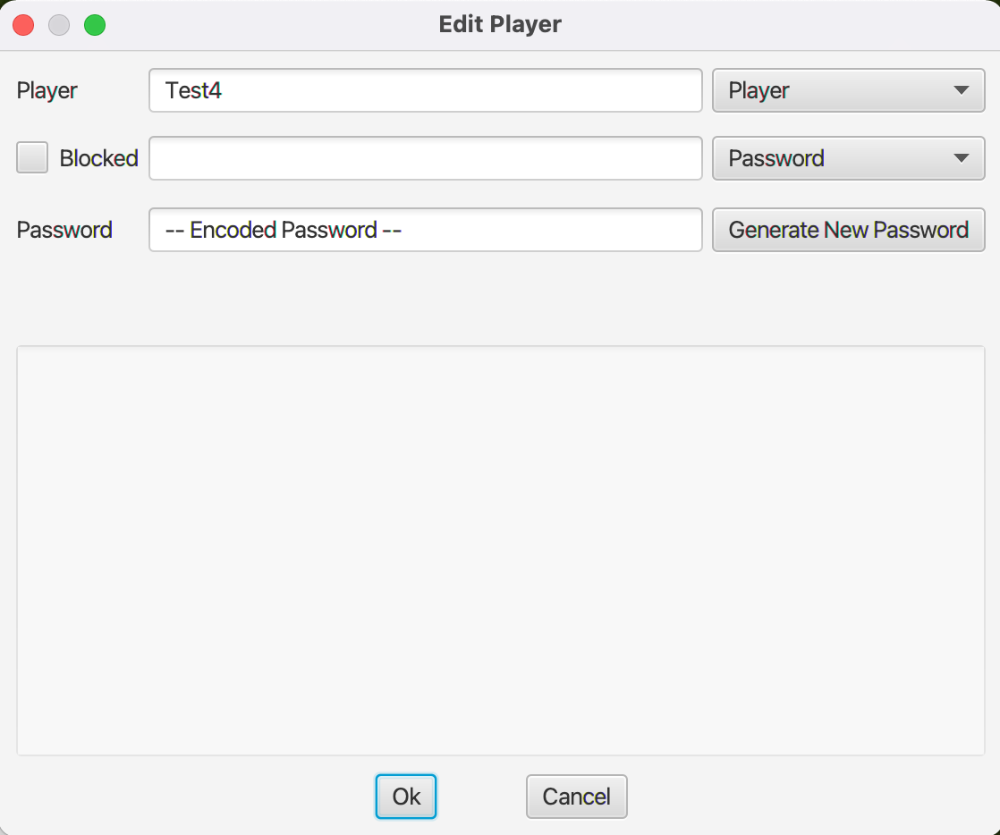
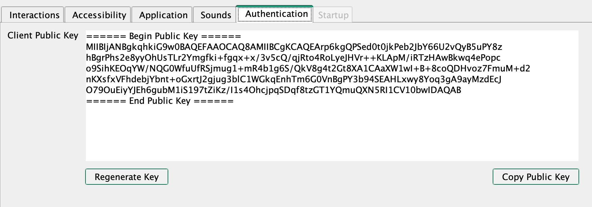

## Authentication types
Prior to version 1.10 MapTool only supported a single method of authentication which is role based authentication. Each Role (GM and Player) has a password and any client that connects and authenticates with either of these passwords gets that role. There is no restriction player names other than everyone has to have a unique name.

In MapTool 1.10 there are three authentication methods.
* Role based
* Player specific passwords
* Public Key

## Using Player Specific Authentication
For player specific passwords and public keys authentication a password file must be used as these require that the name of the players are fixed so that they can be matched to the specific password or public key. When starting the server you can specify that a password file is used.


This will load the password file or create a new one if it doesn't exist.


## Clients Connecting With Public Keys
So that the user does not have to type in a password that will not be used they can check "connect using public Key" from the connect to server dialog.



They do not have to check this box as if the server requests the client attempts to authenticates via public key the client will do so even if the user has specified a password. If this value is checked the only way the client can authenticate is via public key so any password in the password text field will be ignored. 


## Adding, Editing, or Removing Players
The menu option to edit player passwords is under the file menu.


This opens the player database dialog which can be used to add, edit, and remove players. This dialog shows the following information

### Player Database

* Player name
* Role, Player or GM
* Authentication Type, Password or Public Key
* Is the player Blocked
Blocked players will not be able to log in. When they try to connect they will get a message with a reason that they are blocked.

:::note
New, Added, or Modifications to players take effect immediately but the changes will not be written to the password file until this dialog is closed (either with Ok button or dialog close button). This is so that the file will not be continually overwritten many times when making several changes at once.
:::


### Adding or Editing Player
Clicking on the Edit or Add button will open a dialog where you can provide the player details.

This dialog is used to provide the information required for the player database entry.
* Player Name (only editable for Add)
* Role, Player or GM
* If the player has been blocked from logging in, and if so the reason why
* Authentication Type, password or public key
* Player Password (only if authentication type is password)
* Public Key (only if authentication type is public key)

The password is hashed which is a one way operation, so you will not be able to see a players password so if you and the player forget it you will have to change it to a new one.

Its recommended that if you want to use player specific authentication you use public keys as that way neither you or the player will need to remember the password. You can add more than one public key in the public key text field so you can easily support players who have multiple computers.

If you still prefer to use a password over a public key it is **strongly** recommended you use the Generate New Password button so that no one is sharing passwords they may be using elsewhere.

:::note
Setting a plyer to blocked will not kick the player, it will only stop them from attempting to connect to the server. You will need to kick the player if you also want to remove them immediately. At this time kicking a blocked player will not send them the reason that they are blocked/kicked but will do so in a future version.
:::

## Obtaining The Players Public Key
There is a new Authentication tab on the preferences dialog which contains the public key for your client. If you have multiple machines each will have its a different public key, its also possible if you have multiple versions installed with different data directories then these may also have different public keys.



You can regenerate your public key but if you do so then you will not be able to connect to any server that has your old public key so you will need to ensure you let the person running the server know that your public key has been changed. 

Your public key is also stored in the file `.maptool-rptools/config/public.key` (or equivalent data directory).

**Warning:** Your private key is also stored in this directory, do not share this with anyone as if they have both your public and private key they will be able to log in as you on other servers your public key is registered with.


## Password File
The location of the password file -- assuming the standard data directory -- is `.maptool-rptools/config/passwords.json` always ensure that you make a backup before editing it as if you make mistakes and you don't have a backup you may need to regenerate new passwords for all players. Also never update the password file while the server is running. Public keys for players are stored in the the `.maptool-rptools/config/keys` directory. If you use multiple computers or share GM duties with someone else you can copy the `passwords.json` file and `keys` directory and place them in the same directory on the second computer as they contain nothing specific to the computer it was generated on. You should still endeavour to make sure that this password file is shard with as little number of people as possible. Also **never** use passwords that you have used anywhere else in this file even though they are hashed. If you must use passwords use the button to generate new passwords, but you should prefer public keys!

### Format of the Password File
The password file uses json format. 
```json
  "passwords": [
    {
      "username": "p1",
      "password": "/49vX2/i/5YhQZTaalYnoA",
      "salt": "DZAp3sKZSY/vWuLfTG26mhQbOx5PLNT0tRdNvTNMn8KjDlY3jJg180ZBN56ehfkygOk6v0CgySZaufGkOKj7RqOwudzoWZhtNGSabkbI4s85TG7Ecfz8HQQRfIi1XtWrlqkrnuiyD8zQFg9zNr0xvQlUwzL5UOK7emt/xPr2QfU",
      "role": "Player"
    },
    {
      "username": "sp1",
      "publicKeys": [
        "pk1.key"
      ],
      "role": "Player"
    },
    {
      "username": "g1",
      "password": "9SH7OrqlXyRMrSXy2fQHaw",
      "salt": "LOWXSGZ5tNeCwVpzNFuK/4EC+9jHMPmgpZ3Q05kElZyJKSWk0dGQOuZWADH2ZYAs4UvN3DVczMbAO6Dm5+NdnvsZsb/SnZ/xEM0QZ5yvmOh0bGjWEHwqTwFBbRUrzlpzy1nNKdJU8e7G2qWmaLUCDSV5Ut50l9aBfeL29d5btLA",
      "role": "GM"
    },
    {
      "username": "Test4",
      "password": "ZyZpHxUR18RdhQpFk4n+jA",
      "salt": "SucHGWjcbeDcegZo8A6jekB56iICulF3OtbcomJ+MsShuhKrrls2ZE+T25aTj/xAFu5wZlfE129LgBYvw/C3q2zeEyvjEmXprq5rzW8+c8VaXIRPSHbz5ursX5pRL8qcxbsCm4RFozld6R9/P6+IC3TC3DWoq6CRsvzHpIO2Nnc",
      "role": "Player"
    },
    {
      "username": "Test3",
      "password": "EyFrs4pM6Euy5zQLHrFoOw",
      "salt": "Fpvg/PJZGIp7N68OmxMaEGOA1mo4vdg7KoRUDik3Q6P6VovI0YOOdNi3iyo9WgcuukhXjlSoxBqG3Cz/hNQRVVgsXdGwcb86K20imFBbfyzpuNt3a/51u9HTQuYoE8FzzNsTdCI/VPmyQjgvP+AwSYT0i7m/GRXdtugoOWGnDgY",
      "role": "Player"
    }
  ]
}
```

A player entry that uses a public key will look like the following
```json
    {
      "username": "sp1",
      "publicKeys": [
        "pk1.key"
      ],
      "role": "Player"
    }
```
The value in `publicKeys` is the name of the file in the `keys` directory that contains the public keys for the player.

A player entery that uses a password will look like the following
```json
    {
      "username": "Test3",
      "password": "EyFrs4pM6Euy5zQLHrFoOw",
      "salt": "Fpvg/PJZGIp7N68OmxMaEGOA1mo4vdg7KoRUDik3Q6P6VovI0YOOdNi3iyo9WgcuukhXjlSoxBqG3Cz/hNQRVVgsXdGwcb86K20imFBbfyzpuNt3a/51u9HTQuYoE8FzzNsTdCI/VPmyQjgvP+AwSYT0i7m/GRXdtugoOWGnDgY",
      "role": "Player"
    }
```
The `password` field contains the hashed password for the player, the `salt` field is a randomised value that is used in the function used hash the password.

If you want to add players you will not be able to -- or be expected to -- generate the hashed password and salt instead you can instead specify the plaintext password and no salt like the following.
```json
    {
      "username": "Test3",
      "password": "You-Are-Using-A-Random-Password-Arent-You?",
      "role": "Player"
    }
```
Then the next time the server is started this file will be read and the password will be hashed and the file overwritten to only contain hashed passwords and the salt for the password. This will also generate a `passwords.json.backup` before overwriting, ensure that you delete this file after testing as it contains then non hashed version of the passwords. But you did remember to use randome passwords and not passwords that you use elsehwere correct?