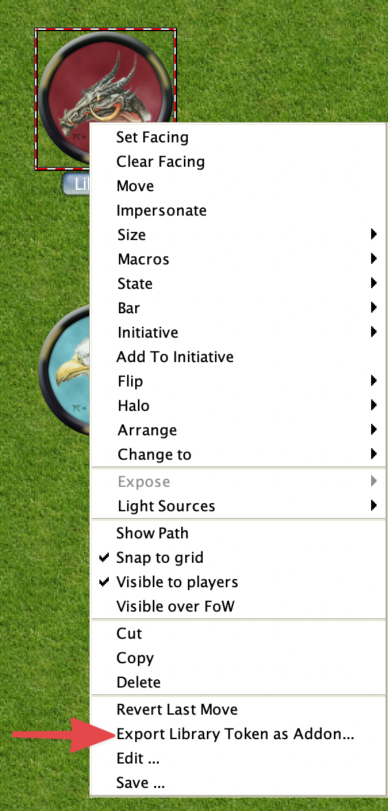

:::caution
This post describes a work in progress so details may change due to feedback. This is also
the reason that the documentation is a bit sparse. Before creating any issues check the bottom of the 
post for things still to be implemented. These features required a *HUGE* amount of behind the scene
changes to how events, lib:tokens, and Assets work, so there will be a large amount of testing 
that needs to be done, I am expecting that there are still several bugs that I have not been able
to uncover yet with my testing. Any help testing would be grealy appreciated. 

It should go without sayind please don't run your games with this yet.
:::

:::note
This information supercedes the previous blog post.
:::

# Add-On Libraries
MapTool 1.11 introduces add-on libraries which are intended to be an easier
to work with replacement for Lib:Tokens while also offering a lot more functionality.
Lib:Tokens will still function the way that they currently do in MapTool 1.11 and future 
versions, but will not be getting a lot of the new features that add-on libraries will have,
so it is recommended that framework developers transition to add-on libraries if supporting 
MapTool 1.11 and above.


I have a very sparse and contrived add-on library I have been using for testing available at
[test-maptool-add-on-lib](https://github.com/cwisniew/test-maptool-add-on-lib)


## Format of add-on library files
Add-On libraries can be shared in a .mtlib file. This file is a zip file with a specific
structure and content. You can import these libraries with the File -> Import Add-On Library menu option.

```
library.json            <-- Configuration information for the add-on library
mts_properties.json     <-- Properties for macro script functions in library
events.json             <-- Event definition for functions in the library
library/                <-- Content of the library
library/public          <-- Content of the library acessable via `lib:// URI`
library/mtscript        <-- MTSCript files
library/mtscript/public <-- MTSCript files that can be called via `[macro(): ]` outside of the library.
```


## format of the configuration file
The library.json configuration file is a json file with the following structure.
```json
{
  "name": "test-library",
  "version": "1.0.0",
  "website": "www.rptools.net",
  "gitUrl": "github.com/RPTools/test-library",
  "authors": [ "RPTools Team" ],
  "license": "GPL 3.0",
  "namespace": "net.rptools.maptool.test-library",
  "description": "My new test library for stuff",
  "shortDescription": "test library",
  "allowsUriAccess": true
}
```

## format of the events configuration file
This json file contains which files should be run for certain events.
```json
{
   "events": [
      { "name": "onFirstInit", "mts": "onFirstInit" },
      { "name": "onInit", "mts": "onInit"}
   ],
   "legacyEvents": [
      { "name": "onInitiativeChangeRequest", "mts": "onInitiativeChangeRequest" },
      { "name": "onInitiativeChange", "mts": "onInitiativeChange" },
      { "name": "onTokenMove", "mts": "onTokenMove" },
      { "name": "onMultipleTokensMove", "mts": "onMultipleTokensMove"}
   ]
}
```
Add ons do not respond to the "onCampaignLoad" event, instead they have 2 new events.
* onFirstInit - This is called only once, when the add on is added. Add the same add on a second time 
overwriting the existing one it will *not* be called again unless the data for the add-on is removed first.
* onInit - This is called every time the campaign is loaded (including after the inital onFirstInit event), and 
on the client when sent to a client. This functionality is very much similar to onCampaignLoad.

The other events must be in the "legacyEvents" section, as the name implies these events are now considered to 
be legacy events, new events will be added in the future to replace these (these will not be removed though).

Currently only macro scripts are supported, in the future JavaScript scripts will also be supported. 


## MTScript macros
* library/public is only exposed via lib:// URI if `allowsUriAccess` is set (see configuration file)
* MTScript macros must all end with the file extension .mts to be recognised.
* Any 
Only MTScript files in `content/mtscript/public` can be called using `[macro():]` from outside of the add-on


The path of the file becomes that macroname for `[macro(): ]` the namespace of the add-on library
is used for the `@` portion.  


Add-On libraries support both public and private macro functions. Public macro functions must 
reside in the mtscript/public and can be called from anywhere (chat, other add-ons, lib:tokens, macro buttons).
You can call them using the following syntax
`[macro("mtscript1@lib:net.rptools.maptool.test-library")]` executes MTScript macro in the file 
`content/mtscript/public/mtscript1.mts`.
:::note
The "public/" is ommited from the macro name when calling it.
You can also use subdirectories to organise your macros and would call them like 
[macro("subdir/script@lib:net.rptools.maptool.test-library")]
:::

The `@this` shorthand can also be used for calling a macro from within the same add-on, similar to how it works
for lib:Tokens. For example
```[macro("mtscript2@this")]```


Macro script files that are not in the "public/" directory can only be called from within the add-on itself or
by events.
Given a library with the namespace ```net.mylib.addon``` with the following files.
```
mtsscript/func1.mts
mtsscript/public/func2.mts
```

```[macro("func1@lib:net.mylib.addon")]``` can be called from anywhere, but ```[macro("func2@lib:net.mylib.addon")]```
can only be called from a macro that is on the ```net.mylib.addon``` add-on.

:::note 
Since the "public/" is not required, if you have to files with the same name excluding the "public/" part, for example
mtscript/public/funct1.mts
mtscript/funct1.mts

Then only the one in public/ will be able to be executed, you will not be able to call the other macro
:::


The above works not just with ```[macro():]``  but the other places you would expect it to as well such as 
defineFunction() for user defined functions and macro links.

### mts_properties.json file
The mts_properties.json file contains property information about macro scripts, it is not required and currrently
only allows you to set properties used in macro links.

```json
{ 
  "properties": [ 
    {
      "filename": "public/auto_exec.mts",
      "autoExecute": true,
      "description": "Auto executable macro link"
    },
    {
      "filename": "public/myUDF.mts",
      "description": "My Test UDF in a drop in lib."
    }
  ]
}
```

Where
* filename is the path of the file for the MacroScript function (excluding mtscript/).
* autoExecute determines if a macro link created for this macro will be auto executable or not.
* description is the description that will appear in the UDF listing, unlike Lib:Token this is just a plain string and not evaluated if it contains `[]`


## public/ directory
The contents of this directory are exposed as a lib:// URI  as long as the allowsUriAccess is set to true in the configuration file.
The public directory part of the filename is discared, for example
public/myhttml.html -> lib://net.myaddons.addon1/myhtml.html

You can add images to this directory and use src="lib://" in image tags in HTML.
It will eventually work with audio (probably aleady does but I haven't tested it yet so not claining it will yet :) )

These assets will be included correctly in the campaign file when saving, so you do not need to add them to image tables or
image tokens or any other tricks to make sure that they are included.


## New MTScript Library functions
* library.listAddOnLibraries()            Lists the add on libraries
* library.getInfo(namespace)              Gets information about a library (either add on or lib:token)
* library.listTokenLibraries(namespace)   Lists the Lib:tokens in the campaign
* library.getContents(namespace)          Lists the contents of a library (trusted)
* library.removeAddOn(namepsace)          Removes an add-on (trusted) (used for testing only, probably wont make it into release)
* library.removeAllAddOns()               Removes all add-ons (trusted) (used for testing only, probably wont make it into release)


## Add-On Libraries and Data
As Add Ons do not live on a token there are no token properties for them. Instead there has been a new
area created for storing data that is a lot more flexible -- and will allow data to be stored agisnt other
entities like maps in the future.
The existing lib property functions below have been modified to work with this new data store if called with
an add-on as the target.
* setLibProperty
* getLibProperty
* getLibPropertyNames
* getMatchingLibProperties

There are some differences to be aware of when using lib property support for add-ons.
* The name is case sensitive, unles tokens where it is not case sensitive.
* The values stored do not need to be be converted to/from strings like they do with lib:tokens so
in many cases for large json values this should result in a speed improvement.
* The default properties list for the campain are not present for Add-Ons as they are not tokens unlike Lib:Tokens


### Macro functions
There are some macro functions that will be included in the alpha build for testing purposes that
will allow you to clear/get/edit the data store. The data store is not intended to be used like this
from macros so they will not be in the release build -- there will probably be something similar in 1.12
though. 
* data.createNamespace(type, namespace) - Creates namespace for data
* data.listNamespaces(type) - Lists the created namespaces for a type
* data.setData(type, namespace, name, value) - Sets a data value in the store
* data.getData(type, namespace, name) - Gets a data value from the store
* data.listData(type, namespace) - Lists the data stored in a namespace
* data.clearData(type, namespace, name) - Clears the data for the given name in the data store
* data.clearNamespace(type, namespace) - Clears all the data from a namespace
* data.clearAllData() - Clears all the data in the data store

For add-ons the type will be 'addon:' and the namespace will be the namespace of the add-on.


## Converting Lib:tokens
The token popup menu includes a way to export your existing library tokens to an add-on.
This is useful for starting the conversion of an existing token library to an add-on but in all but
the simplest lib:tokens you will want edit the extracted data.




### Things you will want to change
* You should probably change the namespace in the library.json file to something that is unlikely to
conflict with other users. Its a good practice to use a reversed hostname + add on name for this.
* All macros (except event based ones) are created in mtscript/public with the pattern macro_{number>.mts, 
this is because macro names have many things that might make them invalid -- or worse dangerous -- filenames.
There is a macro_script_map.txt file saved in the top level which contains the names of your macros and the 
filename that they were saved in.
* Not all macro buttons on lib:tokens always contain MT Script macros, they are used for CSS etc as well so
you will probably want to rename and move them to the library/public/ directory.
* The onCampaignLoad macro will be saved as onInit 
* All properties are saved in the library/properties directory. These are saved with the names prop_{number}.txt
and a mapping file prop_file_map.txt is created to map these. (this may change slightly when data access
is introduced, more the location)

:::note
After doing the above you should *REALLY* take the opportunity to source control your Add-On... 
:::

## Things not yet implemented but will be (so dont create issues for these or I will just close them)
The things detailed below will probably only be implemented for add-ons and there will be no equivalent
functionality for lib:tokens.

### Will be added/addressed in 1.11
* There is currenlty no way to properly retrieve json or other data files as data, once this is
added its recommended to store large static data here rather than in the data store as then it will
only need to be sent to client once which can cache it
* There is currently no way to remove add-ons
* There is only minimal checking of data when importing add-ons so error reporting is not great.
* More documentation

### Possibly will be added/addressed in 1.11 depends on available time
* Many file types like text/markdown etc are allowed in tate he library but the functions to use them dont yet exist
* Way to create user defined functions through property file (so you dont have to call defineFunction in onInit)


### Probably added/addressed in 1.12
* No Management UI yet
* Expanding of JavaScript API which will make this much more useful will be part of another change.
* Displaying readme markdown file
* Displaying more detailed license information 
* Start of support for Add-Ons to to be able to replace "standard" functionality, first things wil be
  * Add-On support for stat sheets (on mouseover on tokens)
  * Add-On support for map selection UI


### Probably added/addressed in 1.13
* Ability to check URL for later version and update from that (most likely github to start with)
* Link Maps to required Add-Ons when exporting/importing
* Dcoumentation / Procuedures for creating a GitHub release for your Add-On.
* The data store could be slightly smatter about large text blocks that remain static and attempt to
 cache them


### Questions I need feedback on
* Add-Ons lack a built in UI, Lib:Tokens have the macro buttons but Add-Ons dont. Better UIs can
now be created for Add-Ons using frame5/dialog5 with the lib:// URL support (we can expand that to added
other things that are needed) but do we also need something similar to what lib:tokens have.


## Other miscellaneous stuff / insanity
One thing to realise is this change allows serveral things that are not immediately obvious. For example,
experiment with frame5/dialog5 and lib:// URI support and ability to store images, you would be surprised
how close it is to devloping a standard web site. As a proof of concept I have even been able to get 
a small React App written in TypeScript running realtively easily by using webpack to bundle it and copy
it into the public directory. (Note the SVG for the beginner React app doesn't work correctly but 
replacing it with a png works).
