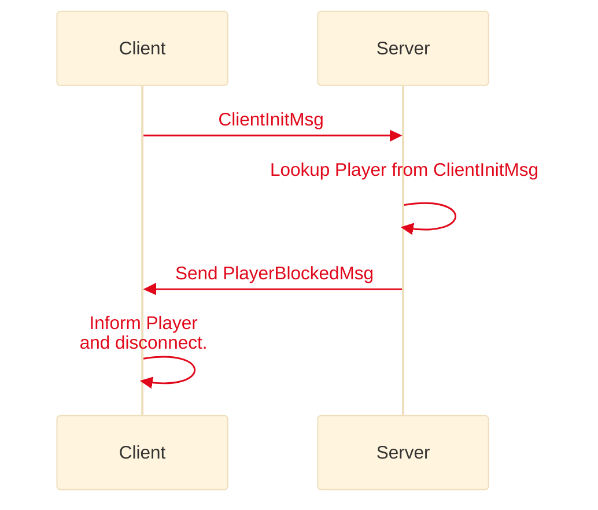
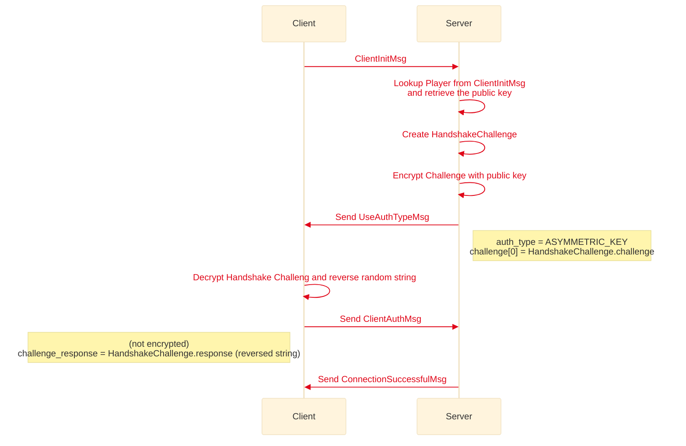
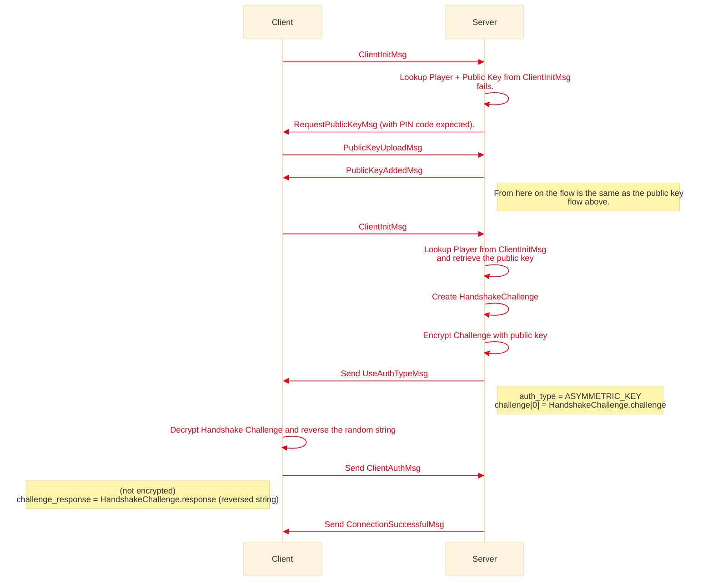
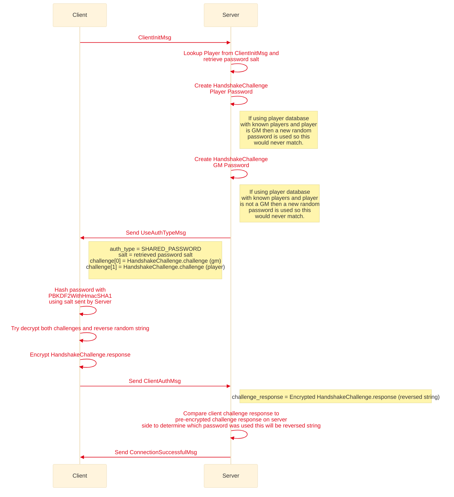

# Handshake and Authentication
Last Updated: MapTool 1.11

The handshake and authentication occurs via protocol buffers messages before any Hessian serialization occurs. Once the handshake and authentication is successful only then will Hessian serialization be used for passing messages between server and client. (This is likely to change in MapTool 1.11 or MapTool 1.12 where Hessian will be completely replaced by protocol buffers)

## Blocked Player
If a player is blocked then the Server will inform the client of this before trying perform any password or public key authentication.



## Player using public key authentication
If the player is not blocked and is authenticating with a public key then the following authentication/handshake sequence occurs. The public key has to be known to the Server before a player can attempt to authenticate this way.

if Not using MapTool easy connect the public key is not sent from client to server via MapTool so the server must know of the public key before hand. The server then encrypts the handshake challenge using the public key which the client will only be able to decrypt if it has access to the matching private key, once decrypted the client sends back the handshake challenge in plaintext as it needs to do no more to show it has the correct private key.



## Connecting with MapTool Easy Connect (uses public key)
If the player is already defined in the player database (and having the same public key that they are trying to connect with) the authentication process follows the above flow of connecting with a public key. Otherwise the following flow is followed.



## Player using shared password authentication
If the player is not blocked and is authenticating with a shared password the following authentication/handshake sequence occurs. As a shared password could be per player or role based (i.e. a single password for players and another single password for GMs) the server creates a challenge for both GM and Player and which ever the client can respond to determines the role. If a password database is used where the role is recorded and the Server knows if the player is a GM or not then a new random password will be used to encrypt the non pertinent handshake challenge ensuring it should never match.

Password information is never sent between the client and the server instead it is used on both sides to encrypt/decrypt the handshake challenge.




## Protocol Buffers
```protobuf reference title="Handshake Protocol Buffers"
https://github.com/RPTools/maptool/blob/develop/src/main/proto/handshake.proto
``` 