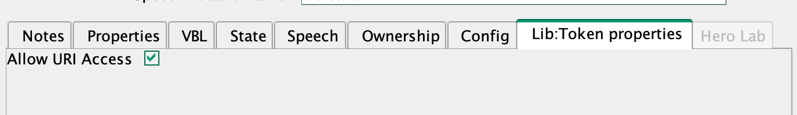
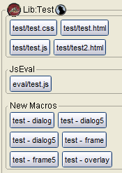
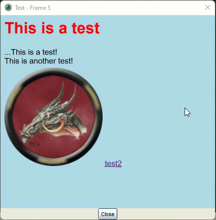

## Issues with HTML/CSS/JavaScript Prior to MapTool 1.10

Prior to MapTool 1.10 creating HTML pages is unnecessary cumbersome. To create HTML dialogs, frames, and overlays you use the following roll options.

- `[frame(): { } ]`
- `[frame5(): { } ]`
- `[dialog(): { } ]`
- `[dialog5(): { } ]`
- `[overlay(): { } ]`

The HTML is included in the `[ ]` which means it has to processed by the MTScript parser. This has both benefits and drawbacks. The main benefit is that you can use `[ ]` to execute MTScript elements as a form of templating the HTML, for example

```
[frame("test): {
    [r: getName() ]
}]
```

The major drawback is that everything included must be able to pass through the MTScript parser, often this will not be the case especially where CSS or JavaScript are concerned. You can work around this problem by using macros functions to fetch text from macro, for example:

```
[frame5("test"): {
    [r: getMacroCommand(number(getMacroIndexes("test/test.html"))) ]
}]
```

## Changes in MapTool 1.10

In MapTool 1.10 there is a change that allows you to access properties and macros on Lib:Tokens via a URI of the form

- lib://_&lt;token name&gt;_/macro/_&lt;macro name&gt;_
- lib://_&lt;token name&gt;_/property/_&lt;property name&gt;_

:::note By default the text fetched using the URI is cached, if you make changes to the content it will not be reflected until you restart MapTool. To work around this you can add the `cachelib=false` query string as show in examples later on in this post. :::

Where _&lt;token name&gt;_ is the name of the Lib:Token after the Lib: prefix, for example Lib:HTMLTest would be HTMLTest

### Allowing URI access

There are no special requirements on ownership for the Lib:Token, to allow URI access to Lib:Token properties and macros, anyone will be able to access these values via a URI if the "Allow URI Access" flag needs is set, you can do this via the edit token dialog. 

or the `setAllowsURIAccess()` macro function.

:::note Reserved names

<details>
  <summary>
    Some names are reserved for future internal usage and you will not be able
    set the "Allows URI Access" flags on Lib:Tokens{" "}
  </summary>
  <div>
    Reserved names are: Lib tokens with the following names (after the lib:
    part)
    <ul>
      <li> rptools </li>
      <li> maptool </li>
      <li> maptools (because people often call it maptools) </li>
      <li> internal </li>
      <li> builtin </li>
      <li> standard </li>
    </ul>
    Lib tokens starting with the following names (after the lib: part)
    <ul>
      <li> rptools. </li>
      <li> maptool. </li>
      <li> maptools. (because people often call it maptools) </li>
      <li> tokentool. </li>
      <li> net.rptools. </li>
      <li> internal. </li>
      <li> _ </li>
      <li> builtin. </li>
      <li> standard. </li>
      <li> . </li>
    </ul>
  </div>
</details>
:::

### Macro functions

Two new MTScript functions have been added that allow you to set or get the "Allows URI access" flag for a token. These can only be run from a trusted macro.

- `getAllowsURIAccess([<token name>], [<map name>])`
- `setAllowsURIAccess(<0|1>, [<token name>, [<map name>])`

### Uses for lib:// URIs

Lib:// URIs are useful for both CSS and JavaScript inclusion in HTML files, creating frames/dialogs/overlays with HTML, and the `js.evalURI()` MTScript functions.

#### Including JavaScript and CSS in HTML using a lib:// URI

```html
<html>
  <head>
    <link
      rel="stylesheet"
      href="lib://HTMLTest/macro/test/test.css?cachelib=false"
    />
  </head>
  <body>
    <h1>This is a test</h1>
    <div id="test1" />
    <script src="lib://HTMLTest/macro/test/test.js?cachelib=false"></script>
    
  </body>
</html>
```

This will include CSS from the macro called test/test.css and the JavaScript from a macro called test/test.js on the Lib:HTMLTest token.

#### Creating frames/dialogs/overlays using a lib:// URI

There are also new MTScript functions that allow you to create frames/dialogs/overlays by passing a lib:// URI which contains the HTML. These are

- `html.dialog(<dialog name>, <libURI>, [<options>])`
- `html.dialog5(<dialog name>, <libURI>, [<options>])`
- `html.frame(<frame name>, <libURI>, [<options>])`
- `html.frame5(<frame name>, <libURI>, [<options>])`
- `html.overlay(<overlay name>, <libURI>, [<options>])`

The optional "options" argument contains the same arguments and format as the frame/dialog/overlay [roll options](https://wiki.rptools.info/index.php/frame5_%28roll_option%29)

### Relative paths
When using the following functions
- `html.dialog5(<dialog name>, <libURI>, [<options>])`
- `html.frame5(<frame name>, <libURI>, [<options>])`
- `html.overlay(<overlay name>, <libURI>, [<options>])`

The URLs in the HTML file can also be specified using relative paths, for example Given



If the HTML is loaded from `test/test.html` you can use relative paths for the other macros as below

```html
<html>
<head>
    <link rel="stylesheet" href="./test.css?cachelib=false">
</head>
<body>
    <h1>This is a test</h1>
    <div id='test1'/>
    <script>
        document.getElementById('test1').innerHTML = '...This is a test!';
    </script>
    <script src="./test.js?cachelib=false"></script>
    
    <a href="./test2.html">test2</a>
</body>
```

This will even work for hyperlink navigation as seen in the link to `./test2.htlm` aboove




#### Running JavaScript from a lib:// URI

In addition to being able to include JavaScript in HTML via the `<script>` tag, lib:// URIs can be used to execute JavaScript via the `js.evalUI()`macro function.

- `js.evalURI(<namespace>, <libURI>, [arg1, ... argN])`

Where

- _&lt;namespace&gt;_ is the namespace of the JavaScript context to run the script in.
- _&lt;libURI&gt;_ is the lib:// URI to fetch the JavasScript from.
- [arg1, ... argN] is a comma-separated list of arguments to be passed to the script
