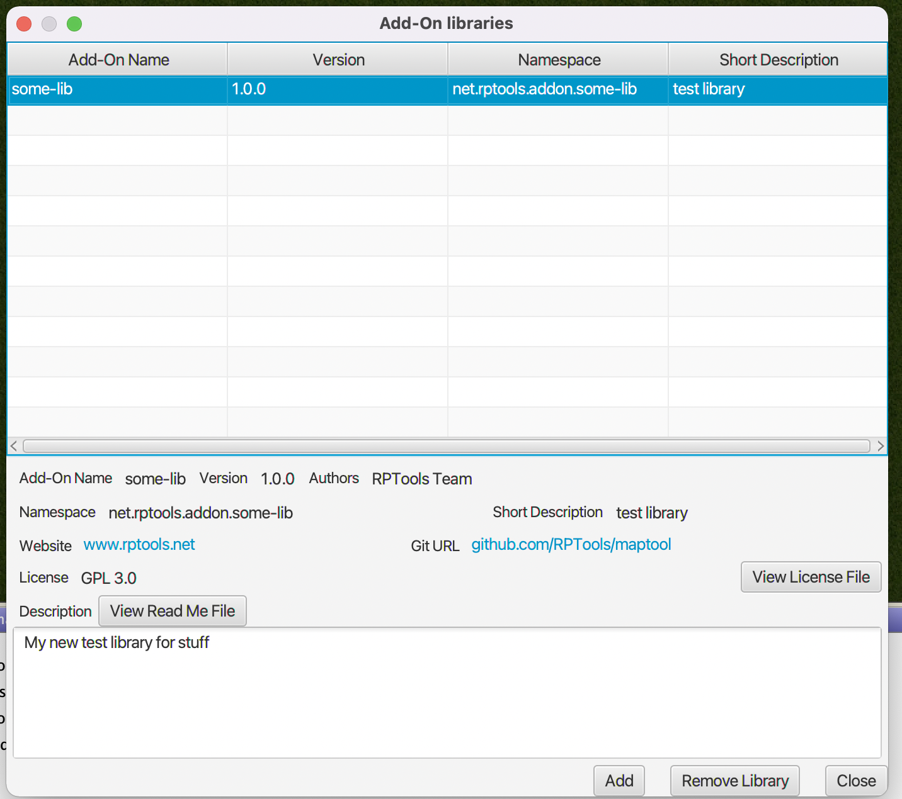
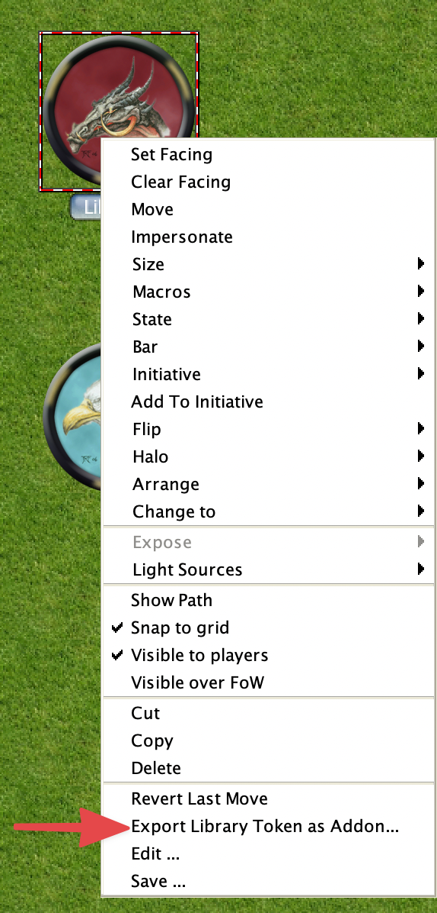

# Creating Add-On Libraries
MapTool 1.11 introduces add-on libraries which are intended to be an easier to work with replacement for Lib:Tokens while also offering a lot more functionality. Lib:Tokens will still function the way that they currently do in MapTool 1.11 and future versions, but will not be getting a lot of the new features that add-on libraries will have, so it is recommended that framework developers transition to add-on libraries if supporting MapTool 1.11 and above.


I have a very sparse and contrived add-on library I have been using for testing available at [test-maptool-add-on-lib](https://github.com/cwisniew/test-maptool-add-on-lib)


## Managing the add-on libraries for your campaign.
The dialog to manage the add-on libraries for your campaign can be reached using the add-on menu item in file menu. 

This dialog can be used to add or remove add-on libraries, view the details of all add-ons in the campaign and view their license/read me files.

### Drag and Drop
As of MapTool 1.12, add-on libraries can be dragged and dropped on to the map from the file explorer / finder. This will either add the add-on library to the campaign or replace it if it is already in the campaign.


## Format of add-on library files
Add-On libraries can be shared in a .mtlib file. This file is a zip file with a specific structure and content. You can import these libraries with the File -> Import Add-On Library menu option.

<table>
  <tr>
    <th>File / Directory name</th>
    <th>Description</th>
  </tr>
  <tr>
    <td>library.json</td>
    <td>Configuration information for the add-on library</td>
  </tr>
  <tr>
    <td>mts_properties.json</td>
    <td>Properties for macro script functions in the add-on library</td>
  </tr>
  <tr>
    <td>events.json</td>
    <td>Events definition for events supported by the add-on library</td>
  </tr>
  <tr>
    <td>library/</td>
    <td>Contents of the add-on library</td>
  </tr>
  <tr>
    <td>library/public/</td>
    <td>Contents of the library that are accessible via <code>lib://</code> URI</td>
  </tr>
  <tr>
    <td>library/mtscript/</td>
    <td>Directory containing the macro Script files for the add-on library.</td>
  </tr>
  <tr>
    <td>library/mtscript/public/</td>
    <td>Directory containing the macro Script files that can be called via `[macro(): ]` outside of
      the add-on library.
    </td>
  </tr>
</table>

## format of the configuration file
The library.json configuration file is a json file with the following structure.
```json
{
  "name": "test-library",
  "version": "1.0.0",
  "website": "www.rptools.net",
  "gitUrl": "github.com/RPTools/test-library",
  "authors": [ "RPTools Team" ],
  "license": "GPL 3.0",
  "namespace": "net.rptools.maptool.test-library",
  "description": "My new test library for stuff",
  "shortDescription": "test library",
  "allowsUriAccess": true,
  "readMeFile": "readme.md",
  "licenseFile": "license.txt",
  "requires": [
      "net.rptools.maptool.lib.tokens"
  ],
  "exports": [
      "/somedir/",
      "/someotherdir/somefile.js"
  ]
}
```

The properties in this file are
  <table>
    <tr>
      <th>Name</th>
      <th>Description</th>
      <th>Required</th>
      <th>Notes</th>
    </tr>
    <tr>
      <th>name</th>
      <td>The name of the add-on.</td>
      <td>Yes</td>
      <td/>
    </tr>
    <tr>
      <th>website</th>
      <td>The website for your add-on.</td>
      <td>No</td>
      <td/>
    </tr>
    <tr>
      <th>gitUrl</th>
      <td>The url for the git source repository.</td>
      <td>No</td>
      <td/>
    </tr>
    <tr>
      <th>authors</th>
      <td>An array of the authors of the add-on.</td>
      <td>Yes</td>
      <td/>
    </tr>
    <tr>
      <th>license</th>
      <td>The name or short description of the license.</td>
      <td>No</td>
      <td/>
    </tr>
    <tr>
      <th>namespace</th>
      <td>The namespace of the add-on.</td>
      <td>Yes</td>
      <td/>
    </tr>
    <tr>
      <th>description</th>
      <td>The description of the add-on</td>
      <td>No</td>
      <td/>
    </tr>
    <tr>
      <th>shortDescription</th>
      <td>The short description of the add-on</td>
      <td>Yes</td>
      <td/>
    </tr>
    <tr>
      <th>allowsUriAccess</th>
      <td>Should add-on allow URI access to contents.</td>
      <td>No</td>
      <td/>
    </tr>
    <tr>
      <th>readMeFile</th>
      <td>The path to the readme file for the add-on.</td>
      <td>No</td>
      <td/>
    </tr>
    <tr>
      <th>licenseFile</th>
      <td>The path to the license file for the add-on.</td>
      <td>No</td>
      <td/>
    </tr>
    <tr>
      <th>requires</th>
      <td>An array of the add-ons that are required (namespaces)</td>
      <td>No</td>
      <td>Added in 1.13</td>
    </tr>
    <tr>
      <th>exports</th>
      <td>An array directories and files that are exported to other add-ons.</td>
      <td>No</td>
      <td>Added in 1.13</td>
    </tr>
  </table>

ReadMe and License files can be plain text, HTML, or Markdown (GitHub Flavored). These can be viewed from the add-on dialog.


:::note
GitHub provides a way to host your own static site at &lt;username&gt;.github.io, if you do not have
your own host this can be used for both your add-on webstite and reversed for namespace, although
there is no requirement fo there to be an actual website running at the address used for the namespace.
:::

## format of the events configuration file
This json file contains which files should be run for certain events.
```json
{
   "events": [
      { "name": "onFirstInit", "mts": "onFirstInit" },
      { "name": "onInit", "mts": "onInit"},
      { "name": "onFirstInit", "js": "/js/onFirstInit" },
      { "name": "onInit", "js": "/js/onInit"}
   ],
   "legacyEvents": [
      { "name": "onInitiativeChangeRequest", "mts": "onInitiativeChangeRequest" },
      { "name": "onInitiativeChange", "mts": "onInitiativeChange" },
      { "name": "onTokenMove", "mts": "onTokenMove" },
      { "name": "onMultipleTokensMove", "mts": "onMultipleTokensMove"}
   ]
}
```
Add ons do not respond to the "onCampaignLoad" event, instead they have 2 new events.
* onFirstInit - This is called only once, when the add on is added. Add the same add on a second time overwriting the existing one it will *not* be called again unless the add-on is removed first.
* onInit - This is called every time the campaign is loaded (including after the inital onFirstInit event), and on the client when sent to a client. This functionality is very much similar to onCampaignLoad.

As of 1.13, the "onFirstInit" and "onInit" events are can specify a JavaScript file to run. Unlike the MTS script you must specify the full path to the file. If you have an entry for both a MTS and a JavaScript script, the JavaScript script will be run first.

The other events must be in the "legacyEvents" section, as the name implies these events are now considered to be legacy events, new events will be added in the future to replace these (these will not be removed though).

Currently only macro scripts are supported, in the future JavaScript scripts will also be supported.


## MTScript macros
* library/public is only exposed via lib:// URI if `allowsUriAccess` is set (see configuration file)
* MTScript macros must all end with the file extension .mts to be recognised.
* Any Only MTScript files in `content/mtscript/public` can be called using `[macro():]` from outside of the add-on


The path of the file becomes that macroname for `[macro(): ]` the namespace of the add-on library is used for the `@` portion.


Add-On libraries support both public and private macro functions. Public macro functions must reside in the mtscript/public and can be called from anywhere (chat, other add-ons, lib:tokens, macro buttons). You can call them using the following syntax `[macro("mtscript1@lib:net.rptools.maptool.test-library")]` executes MTScript macro in the file `content/mtscript/public/mtscript1.mts`. :::note
The "public/" is ommited from the macro name when calling it.
You can also use subdirectories to organise your macros and would call them like 
[macro("subdir/script@lib:net.rptools.maptool.test-library")]
:::

The `@this` shorthand can also be used for calling a macro from within the same add-on, similar to how it works for lib:Tokens. For example `[macro("mtscript2@this")]`


Macro script files that are not in the "public/" directory can only be called from within the add-on itself or by events. Given a library with the namespace `net.mylib.addon` with the following files.
```
mtsscript/func1.mts
mtsscript/public/func2.mts
```

`[macro("func1@lib:net.mylib.addon")]` can be called from anywhere, but `[macro("func2@lib:net.mylib.addon")]` can only be called from a macro that is on the `net.mylib.addon` add-on.

:::note Since the "public/" is not required, if you have to files with the same name excluding the "public/" part, for example mtscript/public/funct1.mts mtscript/funct1.mts

Then only the one in public/ will be able to be executed, you will not be able to call the other macro :::


The above works not just with ```[macro():]``  but the other places you would expect it to as well such as defineFunction() for user defined functions and macro links.

### mts_properties.json file
The mts_properties.json file contains property information about macro scripts, it is not required and currrently only allows you to set properties used in macro links.

```json
{ 
  "properties": [ 
    {
      "filename": "public/auto_exec.mts",
      "autoExecute": true,
      "description": "Auto executable macro link"
    },
    {
      "filename": "public/myUDF.mts",
      "description": "My Test UDF in a drop in lib."
    }
  ]
}
```

Where
* filename is the path of the file for the MacroScript function (excluding mtscript/).
* autoExecute determines if a macro link created for this macro will be auto executable or not.
* description is the description that will appear in the UDF listing, unlike Lib:Token this is just a plain string and not evaluated if it contains `[]`


## public/ directory
The contents of this directory are exposed as a lib:// URI  as long as the allowsUriAccess is set to true in the configuration file. The public directory part of the filename is discared, for example public/myhttml.html -> lib://net.myaddons.addon1/myhtml.html

You can add images to this directory and use src="lib://" in image tags in HTML. It will eventually work with audio (probably aleady does but I haven't tested it yet so not claining it will yet :) )

These assets will be included correctly in the campaign file when saving, so you do not need to add them to image tables or image tokens or any other tricks to make sure that they are included.


There are some differences to be aware of when using lib property support for add-ons.
* The name is case sensitive, unles tokens where it is not case sensitive.
* The values stored do not need to be be converted to/from strings like they do with lib:tokens so in many cases for large json values this should result in a speed improvement.
* The default properties list for the campain are not present for Add-Ons as they are not tokens unlike Lib:Tokens


## Converting Lib:tokens
The token popup menu includes a way to export your existing library tokens to an add-on. This is useful for starting the conversion of an existing token library to an add-on but in all but the simplest lib:tokens you will want edit the extracted data.




### Things you will want to change
* You should probably change the namespace in the library.json file to something that is unlikely to conflict with other users. It's a good practice to use a reversed hostname + add on name for this.
* All macros (except event based ones) are created in mtscript/public with the pattern macro_{number>.mts, this is because macro names have many things that might make them invalid -- or worse dangerous -- filenames. There is a macro_script_map.txt file saved in the top level which contains the names of your macros and the filename that they were saved in.
* Not all macro buttons on lib:tokens always contain MT Script macros, they are used for CSS etc as well so you will probably want to rename and move them to the library/public/ directory.
* The onCampaignLoad macro will be saved as onInit
* All properties are saved in the library/properties directory. These are saved with the names prop_{number}.txt and a mapping file prop_file_map.txt is created to map these. (this may change slightly when data access is introduced, more the location)

:::note After doing the above you should *REALLY* take the opportunity to source control your Add-On... :::


### Things still to be addressed.
* There is only minimal checking of data when importing add-ons so error reporting is not great.
* Expanding of JavaScript API which will make this much more useful will be part of another change.
* Better replacement for user defined functions.
* Providing an equivalent to lib:token buttons
* Ability to check URL for later version and update from that (most likely github to start with)
* Link Maps to required Add-Ons when exporting/importing
* Documentation / Procedures for creating a GitHub release for your Add-On.
* The data store could be slightly smarter about large text blocks that remain static and attempt to cache them
