## Callouts

One of the new additions in MapTool 1.10 is the ability to override the name that appears in the speech or thought bubble callouts in MapTool.

For those that are not already familiar with the functionality MapTool provides the ability to display the following callouts on all clients
* Pointer - Spacebar  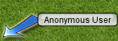

* Speech Bubble - Control + Spacebar  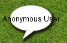

* Thought Bubble - Shift + Spacebar  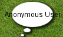

* Pointing Finger - Control + Shift +  Spacebar  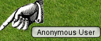

## Setting the Speech/Thought Callout Name

Previously these callouts always render the name of the player regardless of where the callout is or impersonation status. In MapTool 1.10 tokens can have a speech name, this can affect the name displayed for both thought and speech bubbles when the mouse pointer is over the token, or the token is impersonated.

This can be set when dragging a new token on to the map  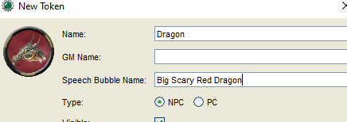

Or by editing existing tokens. 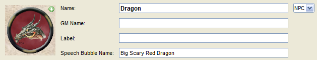

Or via macro.  `setSpeechName("Speech bubble name", tokenId)`

## Related Macros
There are two related macros `getSpeechName()` which returns the speech name for the current token. There is also a trusted variant `getSpeechName(tokenId)` which will return the speech name for the token with the specified id.

`setSpeechName(SpeechBubbleName)` sets the speech name for the current token. There is also a trusted variant `setSpeechName(SpeechBubbleName, tokenId)` which will set the speech name for the token with the specified id.

## Examples
In the following examples the speech and thought bubbles look different to previous versions as another fix in MapTool 1.10 is to size them dynamically so large names wont be rendered outside of the bubbles.

No impersonated token or token under mouse 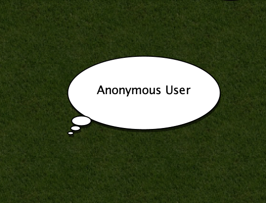

Token with Speech Name 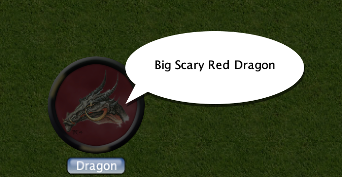

Token with really long speech name 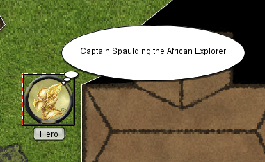

Both the eagle and the Dragon have a speech name 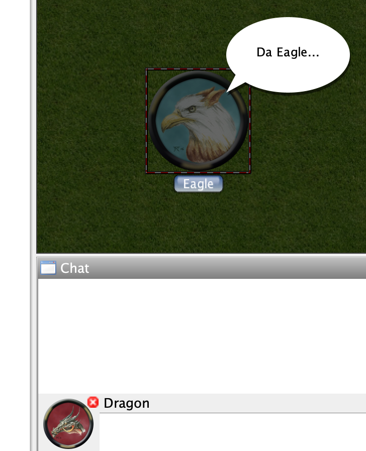

Mage and Familiar with Speech Name, mouse over Mage 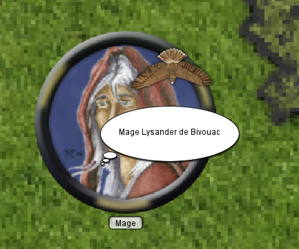

Mage and Familiar with Speech Name, mouse over Familiar 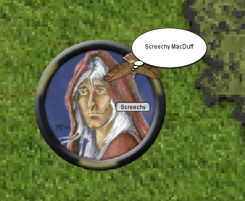

## Determining which name is displayed
 In general when deciding which name to use in speech and thought bubbles MapTool will attempt to show the name associated with the following precedence

 1. Token under the mouse with speech name(if player owns it or is GM)
 2. Impersonated Token with speech name
 3. The players name

Below is a more detailed overview of the logic if you really want to know what it is.

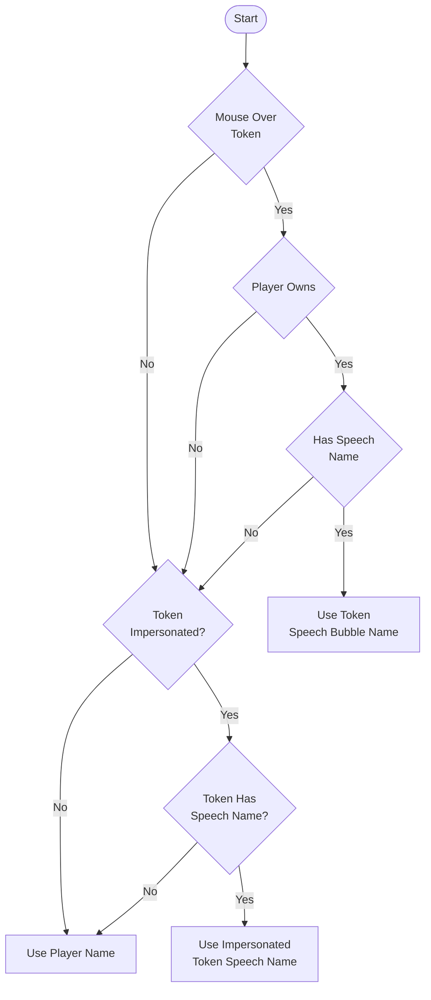

If there are multiple tokens under the mouse (e.g. a Token Stack) and at least one has a speech name then the following logic will be used to determine which is used.

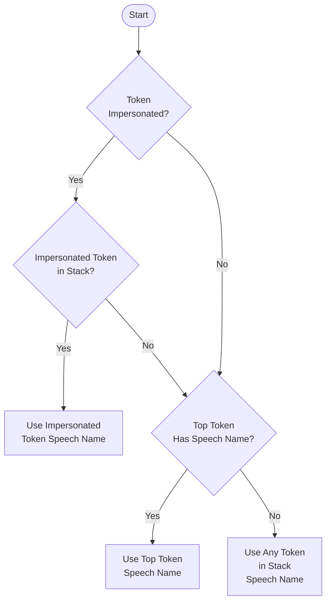